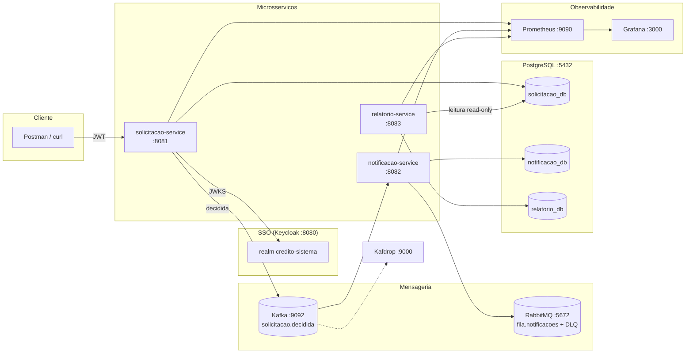

# Sistema de Aprovação de Crédito

[](https://github.com/andrelima28439/credito-sistema/actions/workflows/ci.yml)
[](LICENSE)

Sistema de aprovação de crédito em Java: Spring Boot, microsserviços orientados a eventos (Kafka + RabbitMQ), SSO/OIDC (Keycloak), Spring Batch, PostgreSQL, Docker, observabilidade (Actuator/Prometheus/Grafana) e CI no GitHub Actions — tudo com testes automatizados (unitários + integração com Testcontainers).

Decisões técnicas (ADRs) em `docs/decisoes-tecnicas.md`. Arquitetura detalhada em `docs/arquitetura.md`.

## Arquitetura



**Fluxo:** cliente cria solicitação → analista/gerente aprova (valida alçada por valor) → evento no Kafka → notificação (idempotente, com DLQ) → job diário gera CSV + JSON. Detalhes em `docs/arquitetura.md`.

## Pré-requisitos

- Docker + Docker Compose (Docker Desktop no Windows)
- JDK 21 e Maven 3.9+
- No Windows, os testes Testcontainers podem exigir `DOCKER_HOST` apontando para o pipe funcional (ver ADR-023), por exemplo:
  ```powershell
  $env:DOCKER_HOST = "npipe:////./pipe/docker_engine_linux"
  ```
  (No Linux/CI o default funciona. Detalhes em `docs/decisoes-tecnicas.md`, ADR-023.)

## Como rodar do zero

```bash
# 1. Subir a infraestrutura (Postgres, Keycloak, Kafka, RabbitMQ, Kafdrop, Prometheus, Grafana)
docker compose up -d

# 2. Aguardar tudo healthy (Keycloak leva ~1-2 min no primeiro boot)
docker compose ps

# 3. Rodar todos os testes (unitários + integração com Testcontainers)
mvn test

# 4. Subir os serviços (um terminal cada)
java -jar solicitacao-service/target/solicitacao-service-0.0.1-SNAPSHOT.jar
java -jar notificacao-service/target/notificacao-service-0.0.1-SNAPSHOT.jar
java -jar relatorio-service/target/relatorio-service-0.0.1-SNAPSHOT.jar
# (gere os jars antes com: mvn -q -DskipTests package)
```

UIs úteis: Keycloak http://localhost:8080 (admin/admin) · Swagger http://localhost:8081/swagger-ui.html · RabbitMQ http://localhost:15672 (guest/guest) · Kafdrop http://localhost:9000 · Prometheus http://localhost:9090 · Grafana http://localhost:3000 (admin/admin).

## Keycloak

- Realm `credito-sistema` (importado automaticamente de `keycloak/realm-export.json`)
- Client `solicitacao-service` (confidential; secret de dev: `solicitacao-secret-dev-123`)
- Roles: `CLIENTE`, `ANALISTA`, `GERENTE` (em `realm_access.roles` no JWT)
- Usuários de teste (senha `senha123`): `cliente1` / `analista1` / `gerente1`

Obter token via curl (password grant, para testes):

```bash
curl -s -X POST http://localhost:8080/realms/credito-sistema/protocol/openid-connect/token \
  -H "Content-Type: application/x-www-form-urlencoded" \
  -d "grant_type=password" \
  --data-urlencode "client_id=solicitacao-service" \
  --data-urlencode "client_secret=solicitacao-secret-dev-123" \
  --data-urlencode "username=cliente1" \
  --data-urlencode "password=senha123" \
  --data-urlencode "scope=openid"
```

## Demonstração do fluxo (curl)
```bash
# criar (como CLIENTE)
curl -s -X POST http://localhost:8081/solicitacoes \
  -H "Authorization: Bearer $TOKEN_CLIENTE" -H "Content-Type: application/json" \
  -d '{"valor": 5000}'

# aprovar (como ANALISTA; acima de 10000 só GERENTE)
curl -s -X PATCH http://localhost:8081/solicitacoes/<id>/aprovar \
  -H "Authorization: Bearer $TOKEN_ANALISTA"

# relatório do dia (disparo manual)
curl -s -X POST "http://localhost:8083/relatorios/diario" 
# gera relatorios/relatorio-AAAA-MM-DD.csv + relatorios/resumo-AAAA-MM-DD.json
```

Regra de alçada: até R$ 10.000 → `ANALISTA` ou `GERENTE`; acima → só `GERENTE`.

## Demonstração via Postman

Importe os dois arquivos (com o environment `Credito Sistema (local)` selecionado):

- `postman/credito-sistema.postman_collection.json`
- `postman/credito-sistema.postman_environment.json`

Rode na ordem: **1. Login** (preenche os 3 tokens sozinho) → **2. Cliente cria** → **3. Analista aprova** → **4. Gerente aprova (valor alto)** → **5. Tentativa de acesso negado** (assert automático de `403`).
Via CLI (mesma validação do CI manual): `npx -y newman@6 run postman/credito-sistema.postman_collection.json -e postman/credito-sistema.postman_environment.json`.

## Testes

```bash
mvn test
```

30 testes (12 unitários da regra de alçada + 18 de integração com Postgres/Kafka/RabbitMQ reais em containers): CRUD + RBAC + autorização negativa cross-cliente + evento Kafka + DLQ após 3 tentativas + idempotência (2x→1) + poison Kafka + job Batch ponta a ponta com rerun.

Cobertura (JaCoCo, gerado no `verify`): `*/target/site/jacoco/index.html` por módulo
(solicitacao ~85%, notificacao ~89%, relatorio ~85% de linhas).

## Observabilidade

- Logs em JSON nos 3 serviços (campo `servico` + `correlation-id` quando houver)
- Correlation-id: envie `X-Correlation-Id` (ou receba um gerado de volta no response); ele viaja no evento Kafka até o notificacao-service
- Métricas: `/actuator/prometheus` nos 3 serviços; Prometheus em http://localhost:9090, Grafana em http://localhost:3000 (admin/admin) com dashboard "Credito Sistema"
- Métrica de negócio: `solicitacoes_decididas_total{status="APROVADA"|"REJEITADA"}`

## Estrutura

```
credito-sistema/
├── docker-compose.yml
├── pom.xml                        (pai multi-módulo)
├── keycloak/realm-export.json
├── solicitacao-service/
├── notificacao-service/
├── relatorio-service/
├── docker/prometheus/ docker/grafana/
├── docs/arquitetura.md docs/decisoes-tecnicas.md
└── .github/workflows/ci.yml
```

## Limitações conhecidas (e o que seria diferente em produção)

- **Segredos de dev no repo** (`solicitacao-secret-dev-123`, `senha123`, `guest/guest`): só para ambiente local; em produção viriam de vault/Secrets, e o realm teria políticas de senha, brute-force e expiração.
- **Keycloak em modo dev com H2 efêmero**: qualquer recreate perde o estado runtime (o import garante a base); em produção, Postgres dedicado + TLS + cluster.
- **Serviços internos sem auth** (`notificacao-service`, `relatorio-service`, actuators abertos): aceitável em rede local; em produção, mTLS/rede privada e actuators protegidos.
- **Relatório lê `solicitacao_db` direto** (read-only): acoplamento de dados assumido por simplicidade; em produção, réplica de leitura ou CDC (ADR-030).
- **Kafka single-node sem TLS, sem Schema Registry** (JSON com `default.type` por serviço + `ErrorHandlingDeserializer`); sem retry/DLT no consumer Kafka (poison = log + skip).
- **Sem circuit breaker, rate limiting ou paginação nos GETs**; `GET /solicitacoes` de aprovador retorna tudo (filtro opcional `?status=`).
- **Batch sem resume parcial**: rerun/restart = reexecução integral com sobrescrita (adequado ao volume; ADR-032).
- **Testes de integração dependem de Docker** e podem flakar sob carga (EOF transitório do broker, isolado por rerun — sem relação com lógica); no Windows exigem `DOCKER_HOST` apontando para o pipe funcional (ADR-023). Mitigação: awaits do `NotificacaoFluxoTest` em 60s (dá tempo ao recovery do Spring AMQP sem mascarar quebra real).
- **CI ainda não executou no GitHub** (repo remoto pendente): workflow validado localmente com os mesmos comandos.

## CI

`.github/workflows/ci.yml` (push/PR): `mvn -B verify` (todos os testes, incluindo Testcontainers) + `mvn -B spotless:check` + upload dos relatórios JaCoCo.

## Licença

Distribuído sob a licença MIT. Veja o arquivo `LICENSE`.
