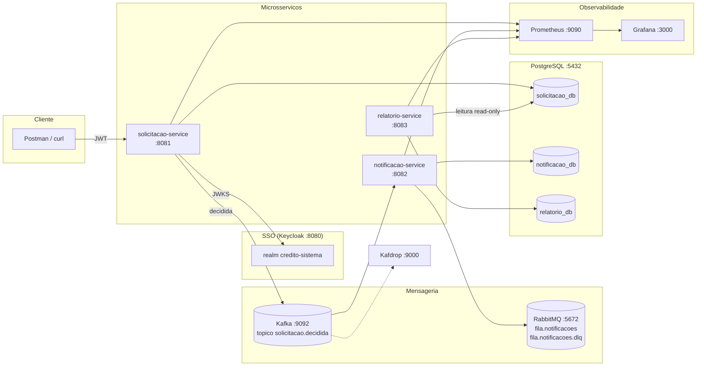

# Arquitetura — Sistema de Aprovação de Crédito

## Diagrama

## Componentes

| Componente | Papel | Porta | Decisão (ADR) |
|---|---|---|---|
| `solicitacao-service` | API REST do domínio (CRUD + alçada + publica evento) | 8081 | 014–021 |
| `notificacao-service` | Kafka → RabbitMQ → "envio" mockado, idempotente, com DLQ | 8082 | 024–029 |
| `relatorio-service` | Job Spring Batch diário (CSV + JSON) | 8083 | 030–034 |
| Keycloak | SSO/OIDC, realm `credito-sistema`, 3 roles | 8080 | 008–013 |
| PostgreSQL | 1 container, 3 databases isolados | 5432 | 001 |
| Kafka (KRaft) | Evento `solicitacao.decidida` | 9092 | 002 |
| RabbitMQ | Fila + DLQ de notificações | 5672/15672 | 004 |
| Kafdrop | Visualizar tópicos Kafka | 9000 | 003 |
| Prometheus/Grafana | Métricas + dashboard mínimo | 9090/3000 | 039 |

## Fluxo ponta a ponta

1. Cliente autentica no Keycloak e recebe JWT com `realm_access.roles = [CLIENTE]`.
2. `POST /solicitacoes` (solicitacao-service extrai `clienteId` do `sub`, salva `PENDENTE`).
3. Analista/Gerente autentica e chama `PATCH /solicitacoes/{id}/aprovar` — o serviço valida a **alçada** (≤ R$ 10.000: ANALISTA ou GERENTE; acima: só GERENTE), persiste `APROVADA`, incrementa `solicitacoes.decididas{status}` e publica `SolicitacaoDecididaEvent{id, status, valor, timestamp, correlationId}` no Kafka.
4. notificacao-service consome o evento (restaura o correlation-id no MDC), publica na `fila.notificacoes`, consome a fila de forma **idempotente** (PK = id do evento) e "envia" (log; SendGrid plugável). Falha 3x → `fila.notificacoes.dlq`.
5. À meia-noite (ou via `POST /relatorios/diario`), o job lê as decididas do dia no `solicitacao_db` (read-only), gera `relatorio-AAAA-MM-DD.csv` + `resumo-AAAA-MM-DD.json`, sobrescrevendo (idempotente).

## Rastreabilidade

Envie `X-Correlation-Id` (ou receba um gerado). O mesmo id aparece nos logs JSON dos dois serviços e dentro do evento. Exemplo real em `docs/decisoes-tecnicas.md` (ADR-036).
